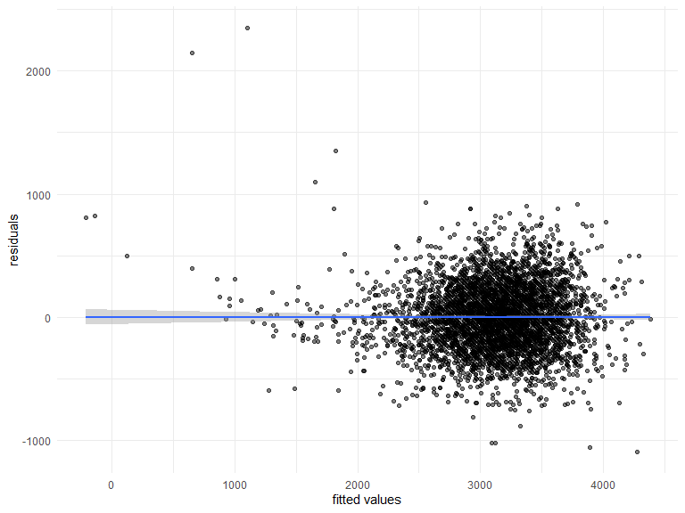
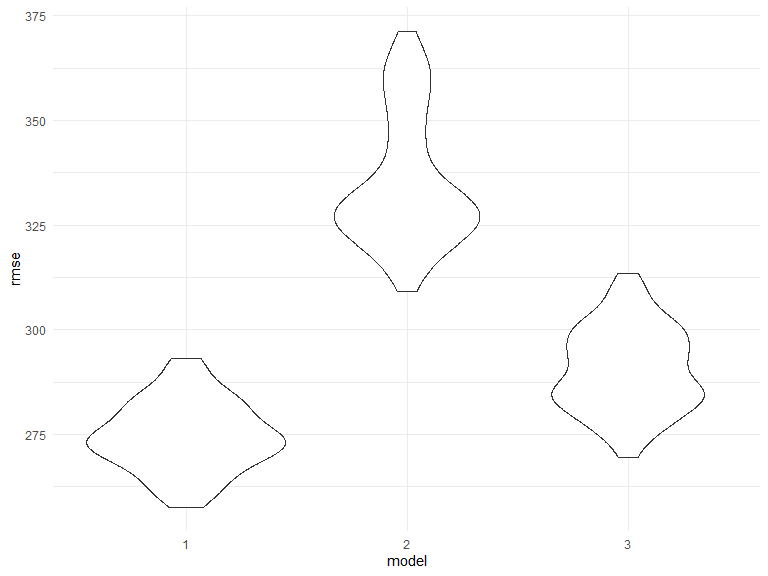
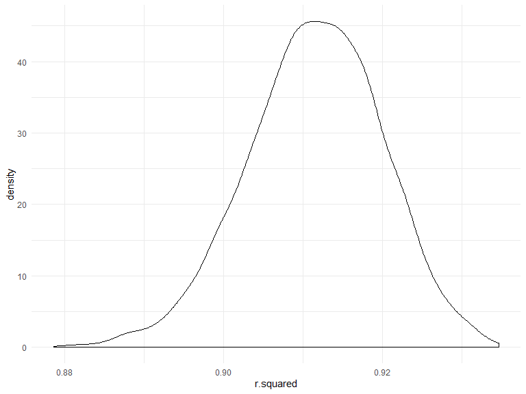
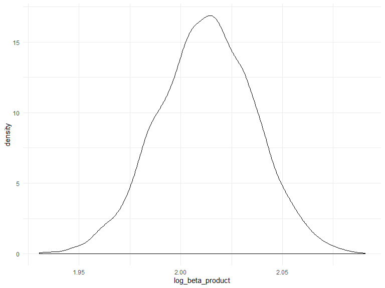

p8105\_hw6\_yq2279
================
Qi Yuchen
2019/11/21

# Problem 1

### Data cleaning

``` r
df_bw = read.csv("data/birthweight.csv") %>% 
  janitor::clean_names() %>% 
  mutate(babysex = factor(babysex,levels = c(1,2), labels = c("male","female")),
         frace = factor(frace, levels = c(1,2,3,4,8,9),labels = c("White","Black","Asian","Puerto Rican","Other","Unknown")),
         malform = factor(malform, levels = c(0,1), labels = c("absent","present")),
         mrace = factor(mrace, levels = c(1,2,3,4,8,9),labels = c("White","Black","Asian","Puerto Rican","Other","Unknown")))

check.na(df_bw) #library(bnpa)
```

    ## 
    ## There is a total of  0  NAs on this file

    ## [1] 0

`babysex`, `frace`, `malform` and `mrace` are converted to factor. No
`NA` values in this dataset.

### Propose a regression model for birthweight

``` r
mult_fit = lm(bwt ~ ., data = df_bw)
step(mult_fit, direction = 'backward')
```

    ## Start:  AIC=48717.83
    ## bwt ~ babysex + bhead + blength + delwt + fincome + frace + gaweeks + 
    ##     malform + menarche + mheight + momage + mrace + parity + 
    ##     pnumlbw + pnumsga + ppbmi + ppwt + smoken + wtgain
    ## 
    ## 
    ## Step:  AIC=48717.83
    ## bwt ~ babysex + bhead + blength + delwt + fincome + frace + gaweeks + 
    ##     malform + menarche + mheight + momage + mrace + parity + 
    ##     pnumlbw + pnumsga + ppbmi + ppwt + smoken
    ## 
    ## 
    ## Step:  AIC=48717.83
    ## bwt ~ babysex + bhead + blength + delwt + fincome + frace + gaweeks + 
    ##     malform + menarche + mheight + momage + mrace + parity + 
    ##     pnumlbw + ppbmi + ppwt + smoken
    ## 
    ## 
    ## Step:  AIC=48717.83
    ## bwt ~ babysex + bhead + blength + delwt + fincome + frace + gaweeks + 
    ##     malform + menarche + mheight + momage + mrace + parity + 
    ##     ppbmi + ppwt + smoken
    ## 
    ##            Df Sum of Sq       RSS   AIC
    ## - frace     4    124365 320848704 48712
    ## - malform   1      1419 320725757 48716
    ## - ppbmi     1      6346 320730684 48716
    ## - momage    1     28661 320752999 48716
    ## - mheight   1     66886 320791224 48717
    ## - menarche  1    111679 320836018 48717
    ## - ppwt      1    131132 320855470 48718
    ## <none>                  320724338 48718
    ## - fincome   1    193454 320917792 48718
    ## - parity    1    413584 321137922 48721
    ## - mrace     3    868321 321592659 48724
    ## - babysex   1    853796 321578134 48727
    ## - gaweeks   1   4611823 325336161 48778
    ## - smoken    1   5076393 325800732 48784
    ## - delwt     1   8008891 328733230 48823
    ## - blength   1 102050296 422774634 49915
    ## - bhead     1 106535716 427260054 49961
    ## 
    ## Step:  AIC=48711.51
    ## bwt ~ babysex + bhead + blength + delwt + fincome + gaweeks + 
    ##     malform + menarche + mheight + momage + mrace + parity + 
    ##     ppbmi + ppwt + smoken
    ## 
    ##            Df Sum of Sq       RSS   AIC
    ## - malform   1      1447 320850151 48710
    ## - ppbmi     1      6975 320855679 48710
    ## - momage    1     28379 320877083 48710
    ## - mheight   1     69502 320918206 48710
    ## - menarche  1    115708 320964411 48711
    ## - ppwt      1    133961 320982665 48711
    ## <none>                  320848704 48712
    ## - fincome   1    194405 321043108 48712
    ## - parity    1    414687 321263390 48715
    ## - babysex   1    852133 321700837 48721
    ## - gaweeks   1   4625208 325473911 48772
    ## - smoken    1   5036389 325885093 48777
    ## - delwt     1   8013099 328861802 48817
    ## - mrace     3  13540415 334389119 48885
    ## - blength   1 101995688 422844392 49908
    ## - bhead     1 106662962 427511666 49956
    ## 
    ## Step:  AIC=48709.53
    ## bwt ~ babysex + bhead + blength + delwt + fincome + gaweeks + 
    ##     menarche + mheight + momage + mrace + parity + ppbmi + ppwt + 
    ##     smoken
    ## 
    ##            Df Sum of Sq       RSS   AIC
    ## - ppbmi     1      6928 320857079 48708
    ## - momage    1     28660 320878811 48708
    ## - mheight   1     69320 320919470 48708
    ## - menarche  1    116027 320966177 48709
    ## - ppwt      1    133894 320984044 48709
    ## <none>                  320850151 48710
    ## - fincome   1    193784 321043934 48710
    ## - parity    1    414482 321264633 48713
    ## - babysex   1    851279 321701430 48719
    ## - gaweeks   1   4624003 325474154 48770
    ## - smoken    1   5035195 325885346 48775
    ## - delwt     1   8029079 328879230 48815
    ## - mrace     3  13553320 334403471 48883
    ## - blength   1 102009225 422859375 49906
    ## - bhead     1 106675331 427525481 49954
    ## 
    ## Step:  AIC=48707.63
    ## bwt ~ babysex + bhead + blength + delwt + fincome + gaweeks + 
    ##     menarche + mheight + momage + mrace + parity + ppwt + smoken
    ## 
    ##            Df Sum of Sq       RSS   AIC
    ## - momage    1     29211 320886290 48706
    ## - menarche  1    117635 320974714 48707
    ## <none>                  320857079 48708
    ## - fincome   1    195199 321052278 48708
    ## - parity    1    412984 321270064 48711
    ## - babysex   1    850020 321707099 48717
    ## - mheight   1   1078673 321935752 48720
    ## - ppwt      1   2934023 323791103 48745
    ## - gaweeks   1   4621504 325478583 48768
    ## - smoken    1   5039368 325896447 48773
    ## - delwt     1   8024939 328882018 48813
    ## - mrace     3  13551444 334408523 48881
    ## - blength   1 102018559 422875638 49904
    ## - bhead     1 106821342 427678421 49953
    ## 
    ## Step:  AIC=48706.02
    ## bwt ~ babysex + bhead + blength + delwt + fincome + gaweeks + 
    ##     menarche + mheight + mrace + parity + ppwt + smoken
    ## 
    ##            Df Sum of Sq       RSS   AIC
    ## - menarche  1    100121 320986412 48705
    ## <none>                  320886290 48706
    ## - fincome   1    240800 321127090 48707
    ## - parity    1    431433 321317724 48710
    ## - babysex   1    841278 321727568 48715
    ## - mheight   1   1076739 321963029 48719
    ## - ppwt      1   2913653 323799943 48743
    ## - gaweeks   1   4676469 325562760 48767
    ## - smoken    1   5045104 325931394 48772
    ## - delwt     1   8000672 328886962 48811
    ## - mrace     3  14667730 335554021 48894
    ## - blength   1 101990556 422876847 49902
    ## - bhead     1 106864308 427750598 49952
    ## 
    ## Step:  AIC=48705.38
    ## bwt ~ babysex + bhead + blength + delwt + fincome + gaweeks + 
    ##     mheight + mrace + parity + ppwt + smoken
    ## 
    ##           Df Sum of Sq       RSS   AIC
    ## <none>                 320986412 48705
    ## - fincome  1    245637 321232048 48707
    ## - parity   1    422770 321409181 48709
    ## - babysex  1    846134 321832545 48715
    ## - mheight  1   1012240 321998651 48717
    ## - ppwt     1   2907049 323893461 48743
    ## - gaweeks  1   4662501 325648912 48766
    ## - smoken   1   5073849 326060260 48771
    ## - delwt    1   8137459 329123871 48812
    ## - mrace    3  14683609 335670021 48894
    ## - blength  1 102191779 423178191 49903
    ## - bhead    1 106779754 427766166 49950

    ## 
    ## Call:
    ## lm(formula = bwt ~ babysex + bhead + blength + delwt + fincome + 
    ##     gaweeks + mheight + mrace + parity + ppwt + smoken, data = df_bw)
    ## 
    ## Coefficients:
    ##       (Intercept)      babysexfemale              bhead  
    ##         -6098.822             28.558            130.777  
    ##           blength              delwt            fincome  
    ##            74.947              4.107              0.318  
    ##           gaweeks            mheight         mraceBlack  
    ##            11.592              6.594           -138.792  
    ##        mraceAsian  mracePuerto Rican             parity  
    ##           -74.887           -100.678             96.305  
    ##              ppwt             smoken  
    ##            -2.676             -4.843

Based on stepwise regression, the model proposed is using multiple
linear regression with predictors babysex, bhead, blength, delwt,
fincome, gaweeks, mheight, mrace, parity, ppwt and smoken.

### Show a plot of model residuals against fitted values

``` r
fit_1 = lm(bwt ~ babysex + bhead + blength + delwt + fincome + gaweeks + mheight + mrace + parity + ppwt + smoken, data = df_bw)

df_bw %>% 
  add_predictions(fit_1) %>% 
  add_residuals(fit_1) %>% 
  ggplot(aes(x = pred, y = resid)) +
  geom_point(alpha = 0.5) + geom_smooth(method = "lm") +
  labs(
    x = "fitted values",
    y = "residuals"
  )
```



### Compare the model to two others

``` r
fit_2 = lm(bwt ~ blength + gaweeks, data = df_bw)
fit_3 = lm(bwt ~ bhead * blength * babysex, data = df_bw)

cv_df =
  crossv_mc(df_bw, 100) %>% 
  mutate(
    train = map(train, as_tibble),
    test = map(test, as_tibble))

cv_df = 
  cv_df %>% 
  mutate(model_1 = map(train, ~lm(bwt ~ babysex + bhead + blength + delwt + fincome + gaweeks + mheight + mrace + parity + ppwt + smoken, data = .x)),
         model_2 = map(train, ~lm(bwt ~ blength + gaweeks, data = .x)),
         model_3 = map(train, ~lm(bwt ~ bhead * blength * babysex, data = .x))) %>% 
  mutate(rmse_1 = map2_dbl(model_1, test, ~rmse(model = .x, data = .y)),
         rmse_2 = map2_dbl(model_2, test, ~rmse(model = .x, data = .y)),
         rmse_3 = map2_dbl(model_3, test, ~rmse(model = .x, data = .y)))

cv_df %>% 
  select(starts_with("rmse")) %>% 
  pivot_longer(
    everything(),
    names_to = "model", 
    values_to = "rmse",
    names_prefix = "rmse_") %>% 
  mutate(model = fct_inorder(model)) %>% 
  ggplot(aes(x = model, y = rmse)) + geom_violin()
```



Based on the result, model\_1, which uses multiple linear regression
with predictors babysex, bhead, blength, delwt, fincome, gaweeks,
mheight, mrace, parity, ppwt and smoken, performs best in predictive
accuracy.

# Problem 2

### Download the data

``` r
weather_df = 
  rnoaa::meteo_pull_monitors(
    c("USW00094728"),
    var = c("PRCP", "TMIN", "TMAX"), 
    date_min = "2017-01-01",
    date_max = "2017-12-31") %>%
  mutate(
    name = recode(id, USW00094728 = "CentralPark_NY"),
    tmin = tmin / 10,
    tmax = tmax / 10) %>%
  select(name, id, everything())
```

    ## Registered S3 method overwritten by 'crul':
    ##   method                 from
    ##   as.character.form_file httr

    ## Registered S3 method overwritten by 'hoardr':
    ##   method           from
    ##   print.cache_info httr

    ## file path:          C:\Users\戚雨晨\AppData\Local\rnoaa\rnoaa\Cache/ghcnd/USW00094728.dly

    ## file last updated:  2019-09-04 17:51:54

    ## file min/max dates: 1869-01-01 / 2019-09-30

### Boostrap

``` r
results = 
  weather_df %>% 
  select(tmin, tmax) %>% 
  modelr::bootstrap(n = 5000) %>% 
  mutate(
    models = map(strap, ~ lm(tmax ~ tmin, data = .x)),
    results_1 = map(models, broom::glance),
    results_2 = map(models, broom::tidy)) %>% 
  select(.id, results_1, results_2)
```

### Plots for r\_squared and log(beta0\*beta1)

``` r
df_r_squared = 
  results %>% 
  select(results_1) %>% 
  unnest(results_1) %>% 
  select(r.squared)
df_r_squared %>% 
  ggplot(aes(x = r.squared)) + geom_density()
```



``` r
df_log_beta = 
  results %>% 
  select(.id, results_2) %>% 
  unnest(results_2) %>% 
  select(.id, term, estimate) %>% 
  pivot_wider(id_cols = .id,names_from = term,values_from = estimate) %>% 
  rename(intercept = "(Intercept)") %>% 
  mutate(log_beta_product = log(intercept * tmin)) %>% 
  select(log_beta_product)
df_log_beta %>% 
  ggplot(aes(x = log_beta_product)) + geom_density()
```



The distributions of r squared and log(beta0\*beta1) are nearly
bell-shaped and approximately normal.

### 95% confidence interval

``` r
df_r_squared %>% 
  summarise("2.5%" = quantile(r.squared,0.025), "97.5% " = quantile(r.squared,0.975)) %>% 
  knitr::kable(caption = "95% confidence interval for r_squared" ) 
```

|      2.5% |   97.5%   |
| --------: | :-------: |
| 0.8939406 | 0.9274106 |

95% confidence interval for r\_squared

``` r
df_log_beta %>% 
  summarise("2.5%" = quantile(log_beta_product, 0.025), "97.5% " = quantile(log_beta_product, 0.975)) %>% 
  knitr::kable(caption = "95% confidence interval for log(beta0*beta1)" ) 
```

|     2.5% |  97.5%   |
| -------: | :------: |
| 1.965117 | 2.058809 |

95% confidence interval for log(beta0\*beta1)
